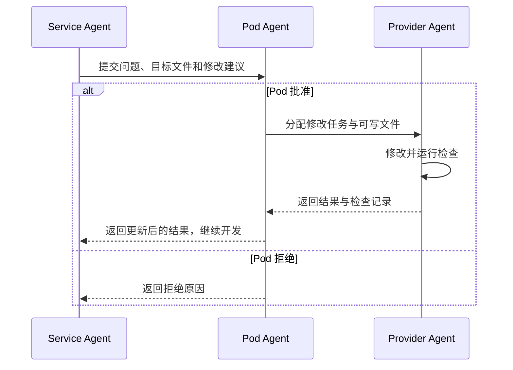

<p align="center">
  
</p>

# AIPod

**让 Agent 在明确的文件边界内开发，由 Pod 协调修改和验收。**

AIPod 是一个 AI 应用开发框架，提供 **Python** 和 **Node.js / TypeScript** 两个实现。你描述目标，Agent 使用文件与 shell 工具完成开发；产物是可以阅读、修改和运行的普通项目代码。

框架保留五层结构：

```text
Model → Provider → Service → Pipeline → Interface
数据      基础能力      领域行为      执行编排      用户入口
```

每层 Agent 共用一套工具和执行循环。Pod 决定层级调度、处理跨层修改申请，并检查最终交付结果。

> 本文描述 GitHub `main` 分支的新工作区 Agent 流程。本次重构尚未重新发布到 PyPI/npm；使用这一流程请按下面的源码安装方式运行。

[Python 包](https://pypi.org/project/AIPodCli/) · [Node 包](https://www.npmjs.com/package/aipod-node) · [Node 使用说明](aipod-node/README.md) · [执行模型](docs/execution.md)

## 核心工作方式

1. **在同一工作区开发。** Agent 可以查看项目文件，在自己的范围内增删改文件、搜索代码和运行 shell。
2. **上游保持只读。** 后续 Agent 发现上游问题时，提交修改原因、目标文件和建议给 Pod。
3. **由文件所属 Agent 修改。** Pod 批准后，将任务交回对应 Agent；申请方不会获得上游写权限。
4. **按实际需要检查。** Agent 自行选择编译、测试或启动命令，修改后重新检查，最后由 Pod 验收。

例如 Service 需要调整 Provider：



跨层修改可能使中间层失效，Pod 会安排这些层重新检查后再继续。批准、拒绝、执行结果及未完成状态都会保存，便于恢复。

默认构建不再为每个组件强制安排“生成测试 → 冻结测试 → 生成实现 → 复制项目验证”的流程。普通测试仍然可用，Agent 可以按需要编写和运行。

## 五层分别负责什么

| 层 | 职责 | 典型内容 |
|---|---|---|
| Model | 定义共享数据 | 用户、订单、向量、场景状态、事件 |
| Provider | 提供基础能力 | 存储、文件、网络、时钟、渲染设备 |
| Service | 实现领域行为 | 创建任务、计算价格、更新位置、检测碰撞 |
| Pipeline | 组合执行步骤 | 顺序、分支合并、并行、重复、流处理 |
| Interface | 提供用户入口 | CLI、Web、桌面界面、消息入口 |

Service 使用 Model 和 Provider，Service 之间的组合放在 Pipeline 中。Interface 通过已注册的路由调用 Pipeline。

这套结构可以用于业务工具，也可以组织模拟程序、游戏原型等项目。具体实现能力仍取决于模型、需求和使用的基础库。

## 快速开始：Python

需要 **Python 3.10+**。以下示例适用于 macOS；Linux 的 Agent shell 还需要 `bubblewrap`。

### 从源码安装

```bash
git clone https://github.com/wangzhongren/ai_pod_cli.git
cd ai_pod_cli

python3 -m venv .venv
source .venv/bin/activate
python -m pip install -e .

mkdir ../demo-python
cd ../demo-python
aipod init
```

### 配置模型

支持 OpenAI-compatible 接口。填写你实际使用的接口地址和模型名称：

```bash
export OPENAI_API_KEY="your-api-key"
export OPENAI_BASE_URL="https://api.openai.com/v1"
export OPENAI_MODEL="your-model"
```

也可以通过 `aipod config set KEY VALUE` 保存到 `~/.aipod/config.toml`。Python 和 Node 共享这份全局配置。

### 开发与修改

```bash
aipod pod "开发一个本地待办应用：任务持久化，支持新增、列表和完成，通过 CLI 使用。" --yes
```

需求较长时可以从文件读取：

```bash
aipod pod --file requirements.md --yes
```

修改已有项目，自动判断最早受影响的层：

```bash
aipod pod "调整 CLI 的输出格式，保留已有任务行为。" --stage auto --yes
```

也可以明确指定层：

```bash
aipod pod "调整任务完成规则。" --stage services --yes
```

指定层之前的产物保持只读；确实需要修改时，仍走 Pod 的审批与转交流程。这里的审批是框架内部协调，不会每次都要求用户确认。

### 查看和运行

```bash
aipod inspect project --json
aipod inspect pipelines --json
aipod interface list
```

根据实际生成的名称、参数和启动说明运行，例如：

```bash
aipod run list_tasks --params '{}'
aipod interface run todo_cli --payload '{"action":"list"}'
```

`list_tasks`、`todo_cli` 及事件格式只是示例，具体以项目注册信息为准。运行已经生成的应用不需要再次调用 AI，除非应用本身包含 AI 功能。

## Node.js / TypeScript

Node 版本使用相同的 Agent 协作规则，需要 **Node.js 20+**。在仓库根目录执行：

```bash
cd aipod-node
npm ci
npm run build

npm run cli -- init ../../demo-node
npm run cli -- pod "开发一个有类型契约的问候服务、路由和 CLI 入口。" --project-root ../../demo-node
npm run cli -- inspect ../../demo-node
```

完整命令、运行时示例和版本差异见 [Node README](aipod-node/README.md)。

| 内容 | Python | Node |
|---|---|---|
| 组件代码 | Python | TypeScript / JavaScript |
| Model | Pydantic / SQLModel | TypeScript 数据声明 |
| 内置持久化 | SQLModel `ModelRepository` | JSON `ModelRepository` |
| 组件注册 | `beans_config.json` | `aipod.json` |
| 路由注册 | `routes.toml` | `aipod.json` |
| Pod 状态 | `aipod_plan.json` | `.aipod/plan.json` |
| Studio | 原生窗口，可选依赖 | 本机 Web 页面 |

两个版本共享设计，底层 API 和已有运行时功能并非完全一致。

## 文件权限

| Agent | Python 可写范围 | Node 可写范围 |
|---|---|---|
| Model | `modules/models/` | `src/models/` |
| Provider | `modules/providers/` | `src/providers/` |
| Service | `modules/services/` | `src/services/` |
| Pipeline | `pipelines/` | `src/pipelines/` |
| Interface | `interfaces/`、`app.py` | `src/interfaces/`、`interfaces/` |

每层还可以写自己的 `tests/<layer>/` 和 `docs/<layer>/`。Pod 管理共享配置、依赖及 `tests/pod/`、`docs/pod/`；运行时注册信息和 Pod 状态由控制器更新，Agent 不直接写这些文件。

文件工具和 shell 受同一套写入范围约束。路径穿越、指向其他层的符号链接写入和硬链接绕过都会被拒绝。

- **macOS**：使用系统 `sandbox-exec` 执行写权限限制。
- **Linux**：需要可运行的 `bubblewrap`。新的共享根文件应先通过文件工具创建，再交给 shell 修改。
- **原生 Windows**：目前不支持这一受限 shell 执行方式；可使用具备 bubblewrap 的 Linux 环境。

缺少权限执行后端时会报错，不会自动切换成无约束 shell。这是开发期的文件写入边界，不是恶意代码的完整安全隔离，也不限制交付应用在正常启动后的全部行为。

## 检查、临时数据与恢复

Agent 在项目目录运行命令，临时数据和缓存保存在 `.aipod/work/<owner>/`。shell 不继承模型 API 凭据；内置存储使用 Agent 的临时数据位置。自定义外部系统仍需要明确的测试配置。

Agent 修改文件或收到上游更新后，需要重新执行检查再交接。Pod 使用同一套工具做最终检查，也可以编写普通验收测试、运行程序并安排所属 Agent 修复。

默认限制：

- 每次 Agent 调用最多 **40 个动作**。
- 每次 Pod 运行最多 **10 次修改申请**。
- shell 默认 **60 秒**，单次最多 **120 秒**，返回有限长度的输出。

失败或中断时保留工作区中的部分改动和状态，不会假装回滚成完整版本。已批准但未完成的修改会继续交给所属 Agent 处理。

你也可以手动运行检查：

```bash
aipod verify --json
aipod verify --json -- python -m unittest discover -s tests/services
```

第一条只做结构检查，结果为 `unverified`。第二条还会执行指定命令；请替换成项目实际使用的测试入口。命令成功是执行证据，不等于完整覆盖了需求。

已有的 `ai_pod_cli.testing.Sandbox`、`component_tests` 和行为测试驱动保留为可选工具，不是新构建流程的前置条件。

## Agent 动作协议

这一协议由框架与模型交互使用，日常使用 CLI 不需要手写。

工具与控制信息使用 JSON：

```json
{"tool":"read","path":"modules/models/task.py"}
```

```json
{"tool":"shell","command":"python -m unittest discover -s tests/services","timeout":60}
```

```json
{"tool":"request_change","target":"providers","paths":["modules/providers/store.py"],"reason":"当前 API 无法完成需求中的操作","change":"补充所需操作并保留现有调用兼容性"}
```

源码创建和更新使用 XML-like / CDATA：

```xml
<create><path>modules/services/example.py</path><content><![CDATA[
class Example:
    def execute(self, ctx):
        return {"value": 42}
]]></content></create>
```

每次响应一个动作。读取长文件时支持 `offset` / `limit`，通过返回的 `next_offset` 继续读取。Agent 结束工作时提交 `finish` 及注册元数据，控制器检查归属和契约后写入注册表。

## Studio

Python 原生 Studio：

```bash
# 在已克隆的仓库目录安装可选依赖
python -m pip install -e '.[studio]'
aipod studio /path/to/project
```

Node 本机 Web Studio：

```bash
# 在仓库的 aipod-node 目录执行
npm run cli -- studio /path/to/project
```

Studio 提供项目结构、源码、路由、运行记录和 Pod 构建状态查看。

## 开发与验证

在仓库根目录运行 Python 回归：

```bash
python -m unittest discover -s tests -t .
```

Node 回归：

```bash
cd aipod-node
npm ci
npm test
```

权限相关测试需要系统允许启动受限子进程。受外层沙盒限制而跳过的项目，应在具备相应权限的本机环境补跑。

更多运行时能力，包括异步、并行、重复和流处理，见 [执行模型](docs/execution.md)。Node 的 Broker/Worker 示例见 [distributed-orders](aipod-node/examples/distributed-orders/README.md)。

## License

[MIT](LICENSE)
