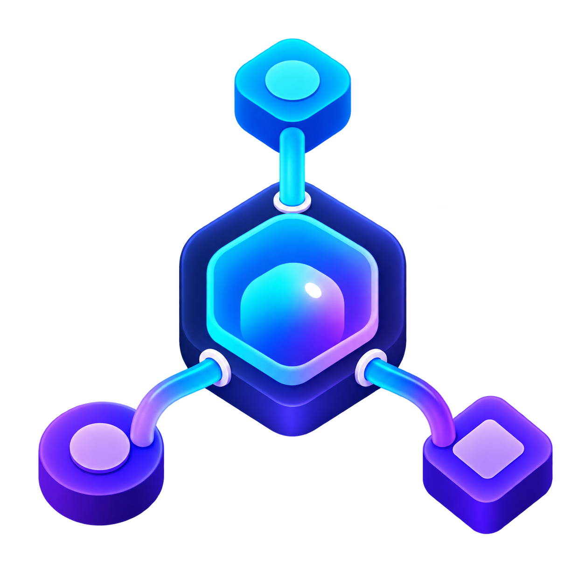
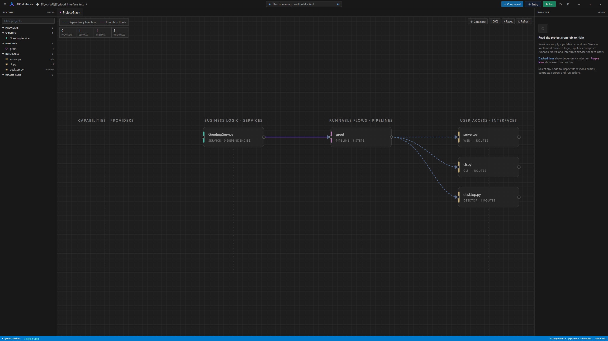

<p align="center">
  
</p>

<h1 align="center">AIPod</h1>

<p align="center"><strong>A governed, compositional Python runtime for AI-built software.</strong></p>

<p align="center">
  <a href="https://pypi.org/project/AIPodCli/"></a>
  <a href="https://pypi.org/project/AIPodCli/"></a>
  <a href="LICENSE"></a>
</p>

AIPod gives AI coding agents a small, explicit programming model instead of asking them
to generate an entire application as an unstructured pile of files.

```text
Software = Data + Capabilities + Transformations + Composition + Delivery

Model     -> Provider     -> Service     -> Pipeline     -> Interface
data         capability      business       program         CLI / Web / Desktop / Worker
```

AI proposes components and composition. AIPod preserves their identities, dependencies,
Contracts, execution order, and project state. The result is ordinary Python code that
can be opened, tested, repaired, and deployed with normal tools.

> AIPod is alpha software. Review generated code before production use.

## Why AIPod

AI is usually good at producing one function. Larger generated applications fail at the
boundaries:

- one Service writes `shipment_count` while the next reads `shipments_count`;
- a Model is accidentally treated as an injected Provider;
- a Service calls a method its Provider never declared;
- a later repair rewrites an earlier working layer;
- a large one-shot response is truncated;
- generated modules exist, but no runnable Pipeline or entry point connects them.

AIPod addresses this with four rules:

1. **Build in dependency order.** Data is decided before capabilities, business logic,
   Pipelines, and Interfaces.
2. **Make boundaries machine-readable.** Bean IDs, import paths, dependencies, inputs,
   outputs, and routes live in project metadata.
3. **Freeze accepted decisions.** An unstable downstream component does not authorize a
   rewrite of stable upstream components.
4. **Verify with real evidence.** Generation uses deterministic structural checks. Real
   tests and entry commands are executed afterward by a developer or external coding
   agent through `aipod verify`.

## Installation

Python 3.10 or newer is required.

```bash
pip install AIPodCli
```

Install the native Studio as well:

```bash
pip install "AIPodCli[studio]"
```

Configure any OpenAI-compatible model endpoint:

```bash
aipod config set OPENAI_API_KEY sk-your-key
aipod config set OPENAI_BASE_URL https://api.openai.com/v1
aipod config set OPENAI_MODEL your-model
```

Configuration is stored globally, so `aipod` can be used from different project
directories. Environment variables and a local `.env` can override global values.

When you explicitly ask Codex or another sandboxed coding agent to use AIPod's AI
generation, that task-level request covers reading the existing global AIPod configuration
and sending the requirement plus the minimum generation context to its configured model
endpoint. Do not paste the API key into the chat. A host permission dialog may still
appear once; grant a scoped reusable permission for the exact AIPod executable and its
`pod` subcommand so the five stages can continue without repeated prompts.

## Quick Start

Create a clean directory and initialize it:

```bash
mkdir expense_tracker
cd expense_tracker
aipod init
```

Put the requirement in `requirements.md`:

```markdown
# Expense Tracker CLI

Build an offline expense tracker with persistent Expense records, Services for adding,
listing, deleting, and summarizing expenses, Pipelines for each use case, and a CLI entry.
Use ModelRepository for persistence and do not write raw SQL.
```

Generate the project:

```bash
aipod pod --file requirements.md --yes
```

Inspect what was built:

```bash
aipod inspect --summary --json
aipod inspect project --json
aipod visualize --open
```

Run a registered route:

```bash
aipod run add_expense --params '{"description":"Lunch","amount":28.5}' --json
```

Verify a real entry or test command:

```bash
aipod verify --json -- python expense_cli.py --help
aipod verify --json -- python -m unittest
```

## The Five-Layer Model

### 1. Model — data

Models are the canonical Python representation of business data.

Runtime values do not create database tables:

```python
from ai_pod_cli import Model

class Vector2(Model):
    x: float
    y: float
```

Persistent entities opt into SQLModel tables:

```python
from sqlmodel import Field
from ai_pod_cli import Model

class Expense(Model, table=True):
    id: int | None = Field(default=None, primary_key=True)
    description: str
    amount: float
```

Models are imported as data types. They are never injected as dependencies.

### 2. Provider — capability

Providers connect the program to infrastructure: files, HTTP, Redis, queues, windows,
audio, or another external system. Only capabilities explicitly required by the project
should be created.

Persistent Models use the built-in `ModelRepository`; Services do not write raw SQL.

### 3. Service — transformation

A Service performs one focused business transformation:

```python
from injector import inject
from ai_pod_cli.context import PipelineContext
from ai_pod_cli.repository import ModelRepository

class SaveExpenseService:
    @inject
    def __init__(self, repository: ModelRepository):
        self.repository = repository

    def execute(self, ctx: PipelineContext):
        expense = ctx.get("expense")
        saved = self.repository.save(expense)
        ctx.set("saved_expense", saved)
        return {"expense_id": saved.id}
```

Inputs and outputs are recorded as Contracts in `beans_config.json`.

### 4. Pipeline — composition

A Pipeline composes registered Services into a program:

```python
from ai_pod_cli.config import load_beans
from ai_pod_cli.container import Pod, build_container
from ai_pod_cli.context import PipelineContext
from modules.services.validate_expense import ValidateExpenseService
from modules.services.save_expense import SaveExpenseService

def run(ctx: PipelineContext):
    S = Pod(build_container(load_beans()))
    (S(ValidateExpenseService) | S(SaveExpenseService)).execute_all(ctx)
    return ctx.summary()
```

The `|` operator expresses deterministic left-to-right composition.

### 5. Interface — delivery

Interfaces are delivery units for a CLI, website, desktop application, worker, native
integration, message consumer, or any combination of them. AIPod provides the stable
`InterfaceAdapter` SDK and `InterfaceContext`; AI generates only the project-specific
event-to-route glue during the build. Runtime execution never calls AI and the Adapter
cannot see or import Services.

```json
{
  "name": "finder-new-file",
  "kind": "windows_desktop_queue",
  "platform": "windows",
  "adapter": {
    "entry_path": "interfaces/order-monitor/adapter.py",
    "class_name": "GeneratedInterfaceAdapter"
  },
  "artifacts": [
    {"path": "interfaces/order-monitor/adapter.py", "role": "adapter_entry"},
    {"path": "interfaces/order-monitor/queue.py", "role": "adapter_module"},
    {"path": "interfaces/order-monitor/window.py", "role": "adapter_module"},
    {"path": "interfaces/order-monitor/event_bridge.py", "role": "adapter_module"},
    {"path": "interfaces/order-monitor/install.ps1", "role": "installer"}
  ],
  "lifecycle": {
    "run": ["{python}", "-m", "ai_pod_cli", "interface", "run", "order-monitor"],
    "install": ["powershell", "interfaces/order-monitor/install.ps1"]
  },
  "permissions": ["message_queue_connect", "desktop_notification"],
  "verify": [
    {"name": "adapter_smoke", "kind": "runtime", "required": true,
     "command": ["{python}", "-m", "ai_pod_cli", "interface", "smoke", "order-monitor"], "timeout": 30}
  ]
}
```

The generated entry inherits `InterfaceAdapter`, receives only `InterfaceContext`, and
calls `context.run_route(...)`. Complex adapters are split across multiple independently
generated files using relative imports: queue transport, Windows UI, event bridge, CLI,
or any other project-specific concern. All Adapter sources are staged together, imported
as one private package, smoked in a disposable project, and committed atomically only
after every required check passes.

## Five-Stage Generation and Runtime Closure

`aipod pod` runs a resumable build-time Agent. A local state machine observes the
Canonical State and deterministically selects the Build Tool for the earliest incomplete
stage. The configured model is used inside that tool to plan or generate the artifact; it
is not called to choose an already-determined stage:

```text
Observe → Policy Select → Execute → Observe evidence
   ↑                                  |
   └──── repair current artifact ─────┘
```

Its first five tools follow the dependency layers, then two application tools close the
runtime loop:

```text
1. generate_models
2. generate_providers
3. generate_services
4. compose_pipelines
5. generate_interfaces
6. verify_application
7. repair_current_artifact
```

The Agent cannot skip the earliest incomplete stage. Each tool plans, generates, checks,
and freezes only its current layer. A failed tool may retry its own unfinished layer but
cannot rewrite a completed upstream layer.

When a completed Pod receives a change request, one focused AI classification selects
the earliest affected layer. This is not per-step tool selection: after the impact
boundary is accepted, the local state machine freezes upstream layers and rebuilds that
layer plus every downstream layer. `aipod pod --stage auto "change request"` exposes the
same behavior in the CLI; an explicit stage remains available as a manual override.

After all five layers are complete, `verify_application` runs every frozen Interface's
explicitly declared command and timeout through the same structured verifier exposed by
`aipod verify`; it does not guess from filenames or natural-language instructions. A
failure does not reopen planning. The next permitted
action is `repair_current_artifact`, which uses project-local traceback evidence to select
one Python file and applies bounded exact-text patches. The same command then runs again.
Three applied repair cycles are allowed before the Agent stops as blocked.

`aipod_plan.json` is both the resumable Canonical Plan and the Agent's public memory. It
stores selected actions, compact decision summaries, observations, validation outcomes,
and stage status—not hidden chain-of-thought. If generation is interrupted, running the
same Pod request resumes the first incomplete tool and reuses frozen components. Plan
version upgrades are applied by `load_and_upgrade_plan()` so older state receives typed
defaults and explicit Interface verification metadata without losing unknown fields.

## Code Is Composable; Chain-of-Thought Is Not

Code has explicit inputs, outputs, types, dependencies, and observable behavior. It can
be composed and tested. Hidden chain-of-thought has none of those guarantees: one model's
private reasoning cannot be safely connected to another model's private reasoning as if
the two formed a deterministic program.

AIPod therefore does not attempt to concatenate reasoning transcripts. It composes
**structured conclusions**.

```text
Worker reasoning (private)     Worker reasoning (private)
           ↓                              ↓
     Decision Fragment              Decision Fragment
           └──────────────┬───────────────┘
                          ↓
                  Leader composition
                          ↓
               Deterministic Reducer
                          ↓
                  Generated program
```

### Worker: solve one bounded problem

A Worker may plan a Model, Provider, Service, Pipeline, or Interface using whatever
reasoning is appropriate. It does not hand its chain-of-thought to the next Worker.
Instead, it returns a small decision fragment:

```json
{
  "id": "AggregateMetricsService",
  "kind": "service",
  "dependencies": ["ConfigStore"],
  "models": ["ParsedLogEntry", "AggregateMetrics"],
  "requires": ["filtered_entries"],
  "provides": ["metrics"],
  "invariants": ["latency percentiles use valid numeric samples only"]
}
```

### Leader: compose meaning

The Leader reads the requirement, Canonical Plan, Bean Pool, and Worker fragments. Its job
is to combine semantic intent:

- decide which fragments belong to the same program;
- select or reject competing proposals;
- preserve decisions already frozen by earlier stages;
- identify missing capabilities or ambiguous boundaries;
- order the next bounded work without rewriting stable work.

The Leader is allowed to reason, but its output must again be structured: accepted
fragments, rejected fragments, unresolved questions, and the proposed dependency graph.
That output is inspectable and can be checked independently.

### Reducer: enforce facts

The Reducer is not another creative Agent. It deterministically checks duplicate
decisions, unknown dependencies, unknown Model references, frozen category conflicts,
and dependency cycles. It never invents a correction to make conflicting fragments fit.

Only reduced decisions proceed to code generation. Validation evidence is reduced to
either acceptance or repair of the current candidate; it does not expand repair scope to
earlier frozen layers.

This creates two different kinds of composition:

```text
Semantic composition      = Leader combines explicit decisions
Executable composition    = Pipeline combines validated code
```

Neither requires chain-of-thought to become project state. The durable project memory is
the Canonical Plan, decision fragments, Contracts, Bean Pool, source code, and execution
evidence.

In the current CLI, the `pod` command is the Leader Agent. Its Build Tools perform bounded
generation work, and the deterministic reducer validates their decision fragments. The
Agent receives the updated project observation after every tool call before choosing its
next action. Parallel external Workers remain a future extension of the same protocol,
not a requirement for using AIPod today.

## Contracts

Contracts describe the fields crossing a component boundary:

```json
{
  "inputs": {
    "tracking_number": "str",
    "options": {"model": "modules.models.options.Options"}
  },
  "outputs": {
    "shipment": {"model": "modules.models.shipment.Shipment"}
  }
}
```

AIPod checks:

- expected class name and category;
- Service `execute(ctx)` and Pipeline `run(ctx)` entry points;
- blocked dynamic-code constructs;
- dependency IDs and Model-as-data rules;
- fields read from and written to `PipelineContext`;
- adjacent Pipeline field names, types, and structured schemas;
- raw SQL inside generated Services.

Validation is progressive rather than deferred to the final Interface. Model candidates
must import and instantiate in a disposable project; Providers must construct through DI
and smoke their declared methods; Services execute with contract-derived synthetic input;
and Pipelines run in a disposable project before they are registered. External resources
remain synthetic and bounded. The final Interface then supplies real application and
platform-specific evidence.

## Real Verification and Agent Repair

Run structure checks only (the top-level status is `unverified`, not `passed`):

```bash
aipod verify --json
```

Run a real command without shell interpolation:

```bash
aipod verify --timeout 120 --json -- python app.py --smoke
```

The result includes:

- project structural status;
- exact command and exit code;
- bounded stdout and stderr;
- project-local traceback files and line numbers;
- suggested repair files;
- redaction of common API key and Bearer token formats.

AIPod does not embed Codex, Claude Code, Pi, or another third-party coding agent. The Pod
Agent can ask its already configured model for constrained patches, but AIPod itself
selects the traceback file, limits patch size, runs deterministic validation, and repeats
the exact verification command. [`SKILL.md`](SKILL.md) remains the portable handoff
protocol when a human wants an external coding agent to inspect or extend the project.

```text
AIPod Pod Agent generates the five layers
                 ↓
verify_application runs real application evidence
                 ↓ failure
repair_current_artifact patches one traceback-selected file
                 ↓
the exact same verification command runs again
```

Install or copy this repository as an `aipod-development` skill in the skill directory
used by your coding agent. Codex-specific display metadata is included in
`agents/openai.yaml`.

## Native Studio

```bash
aipod studio .
```

<p align="center">
  
</p>

Studio provides:

- a VS Code-inspired native workspace using `pywebview + WebView2`;
- project directory switching and initialization;
- AI-first and manual component creation;
- non-blocking generation progress and cancellation;
- a graph of Models, Providers, Services, Pipelines, and Interfaces;
- dependency and execution-route edges;
- zooming, panning, fixed canvas controls, and collapsible navigation;
- syntax-highlighted source tabs;
- Pipeline composition and entry execution;
- streamed program output and run traces.

### Pod Agent visibility

The Studio does not treat Pod generation as a single opaque request. While the Agent is
working, the progress dialog reports the active planning, generation, composition,
Interface, verification, or repair action. After the run, the same public state is
available in three places:

- the status bar shows `Pod Agent: pending`, `passed`, `failed`, or `blocked`;
- Explorer shows `Pod Agent > Application verification`;
- selecting that row opens the exact command, attempt count, repair count, most recently
  repaired file, and recent Agent actions in the Inspector.

A `passed` result belongs to the verified application sources, not merely to the saved
plan. If relevant project code or runtime configuration changes, AIPod detects the source
fingerprint change and returns verification to `pending` until the application is run
again. This prevents Studio from presenting stale success as current evidence.

Built-in runtime Providers are hidden from the graph by default so the view focuses on
project-owned architecture.

## Runtime Results and Policies

Services may return dictionaries or explicit results:

```python
from ai_pod_cli import Effect, Failure, Success

return Success(
    output={"shipment_id": 42},
    effects=(Effect("database.write", {"model": "Shipment"}),),
)

return Failure("inventory unavailable", code="inventory_unavailable", retryable=True)
```

Sequential execution supports retry, timeout, and fallback policies through component
metadata. Execution steps and Effects are recorded in Pipeline traces.

## Project Files

```text
project/
├── aipod_plan.json          resumable five-stage decisions
├── beans_config.json        Bean Pool and Contracts
├── config.toml              application configuration
├── routes.toml              route-to-Pipeline mapping
├── requirements.txt         generated Python dependencies
├── modules/
│   ├── models/
│   ├── providers/
│   └── services/
├── pipelines/
├── interfaces/
│   └── <interface-id>/
│       ├── interface.json
│       └── generated Artifacts
├── docs/aipod/              generated human-readable Pod plans
└── .aipod/runs/             redacted execution traces
```

## CLI Reference

| Command | Purpose | Uses AI |
|---|---|:---:|
| `aipod init [--install-deps]` | Initialize the current directory | No |
| `aipod pod DESC [--file FILE] [--yes] [--json]` | Build or resume all five stages | Yes |
| `aipod pod --stage auto DESC` | Modify from the AI-selected affected layer | Yes |
| `aipod interface list/run/smoke/install/uninstall` | Execute a frozen Interface Adapter | No |
| `aipod create --category model/provider/service --name NAME --desc DESC` | Generate one component | Yes |
| `aipod add --category model/provider/service --name NAME --class-path PATH --desc DESC` | Register hand-written code | No |
| `aipod compose CMD [--name NAME] [--json]` | Generate and register a Pipeline | Yes |
| `aipod entry DESC` | Generate an Interface | Yes |
| `aipod run ROUTE [--params JSON] [--json]` | Execute a route and persist its trace | No |
| `aipod inspect [TARGET] [NAME] [--summary] [--json]` | Read stable project state | No |
| `aipod verify [--timeout N] [--json] -- COMMAND...` | Produce real repair evidence | No |
| `aipod visualize [--output FILE] [--open]` | Export the project graph | No |
| `aipod studio [PATH] [--debug]` | Open native Studio | No |
| `aipod config set/get/remove/list/path` | Manage global model configuration | No |

## Development

```bash
git clone https://github.com/wangzhongren/ai_pod_cli.git
cd ai_pod_cli
python -m venv .venv
.venv\Scripts\activate
pip install -e ".[studio]"
python -m unittest discover -s tests
```

On Windows terminals using a non-UTF-8 code page:

```powershell
$env:PYTHONUTF8 = "1"
```

## Current Boundaries

- Pipeline composition is currently sequential.
- Contract analysis cannot prove arbitrary Python semantics.
- `AIPodCli` is the distribution name; generated Python code imports `ai_pod_cli`.
  Interface validation rejects invented project/Pod package imports.
- Similar field names are advisory warnings; only explicit type, Model, required-field,
  and nested-Schema incompatibilities invalidate composition.
- Privileged Effect approval and denial policies are not yet enforced.
- AIPod governs model behavior and repair scope; it is not a security sandbox for
  untrusted Python code. Generated code still requires review and deployment isolation.
- External model providers may impose output and reasoning-token limits.

## Roadmap

- parallel, asynchronous, event, and streaming composition;
- privileged Provider and Effect approval policies;
- rollback and compensation operators;
- richer Contract diagnostics without duplicating canonical Models;
- reusable component packages and a governed capability registry;
- deeper Studio integration with Agent-neutral verification reports.

## License

[MIT](LICENSE)
